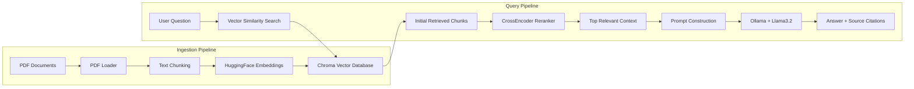
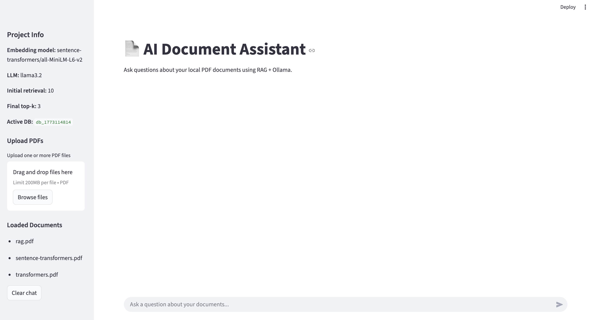
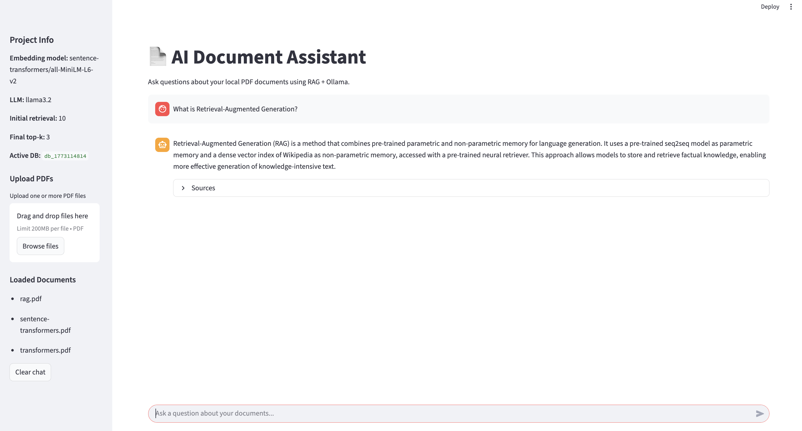
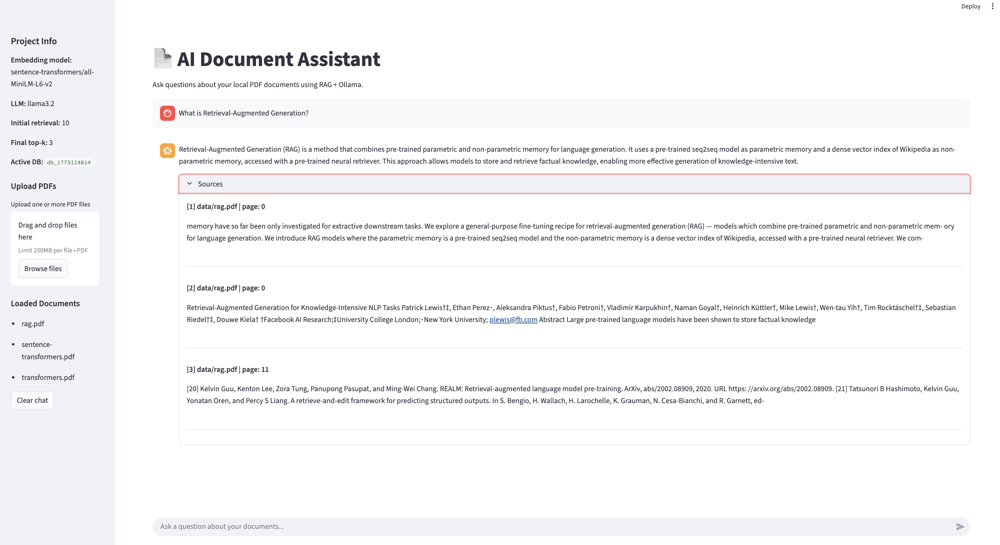
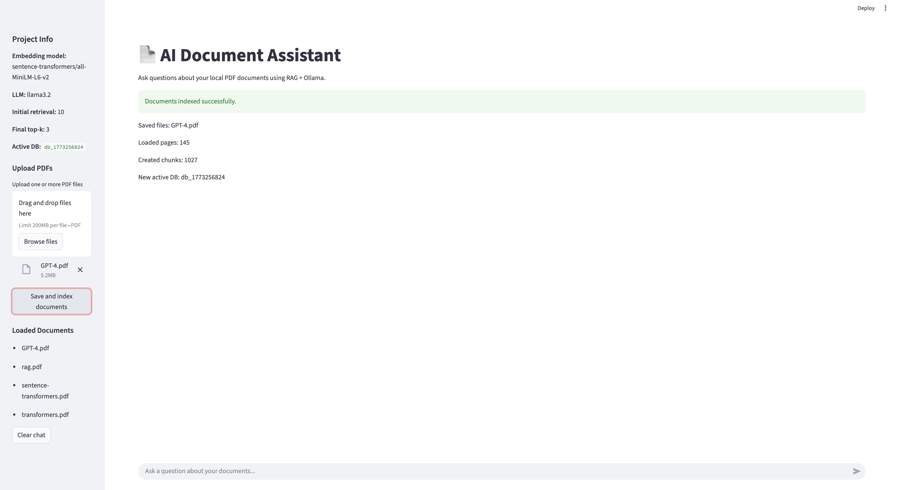
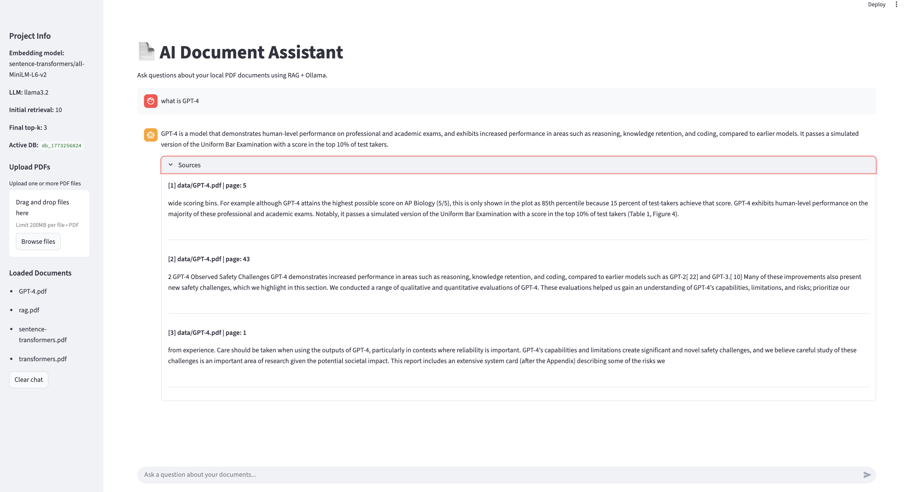
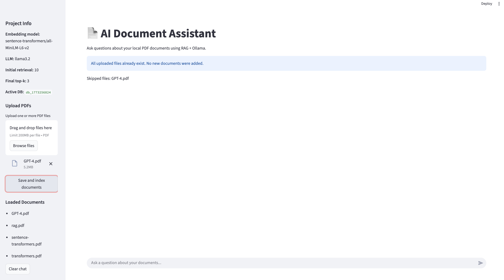
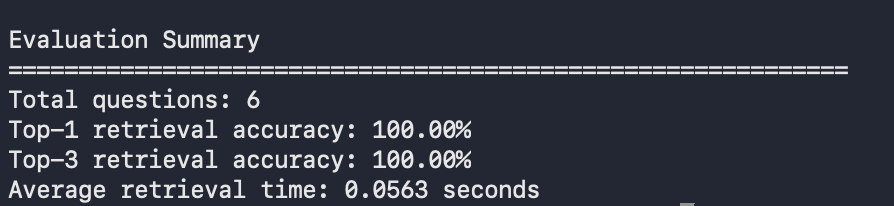
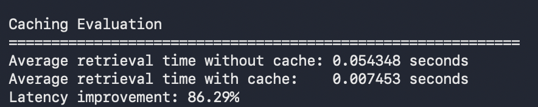
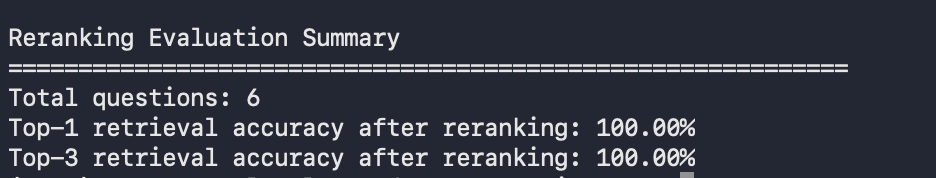

# Local RAG Document Assistant

A **fully local Retrieval-Augmented Generation (RAG) document assistant** that answers questions from PDF documents using **vector search, reranking, and a local language model**.

This project demonstrates both **production-style AI system engineering** and **research-style evaluation**, showing how modern RAG pipelines can be built, optimized, and experimentally analyzed.

Demo: Run locally with Streamlit to interactively query PDF documents.

---


---

# Quick Start

Clone the repository:

```bash
git clone https://github.com/rutujad9/local-rag-document-assistant.git
cd local-rag-document-assistant
```

Create a virtual environment:

```bash
python3 -m venv venv
source venv/bin/activate
```

Install dependencies:

```bash
python3 -m pip install -r requirements.txt
```

---

# Run the Application

Start the Streamlit interface:

```bash
python3 -m streamlit run app.py
```

The browser interface allows you to:

- Upload PDF documents
- Ask questions about documents
- View answer sources and document pages

---

# Overview

Large Language Models can generate answers but often lack access to external knowledge.

This project implements a **Retrieval-Augmented Generation (RAG) pipeline** that retrieves relevant information from PDF documents and uses it to generate grounded answers.

The system combines **vector embeddings, semantic search, reranking, and a local LLM** to provide accurate responses with **source citations**.

In addition to the application itself, the repository includes **evaluation scripts and benchmarking experiments** to analyze retrieval accuracy, reranking effectiveness, and latency improvements through caching.

---

# System Architecture

The assistant follows a Retrieval-Augmented Generation pipeline:

```
User Question
      │
      ▼
Vector Similarity Search (Chroma DB)
      │
      ▼
Initial Retrieval (Top-K chunks)
      │
      ▼
CrossEncoder Reranker
      │
      ▼
Top Relevant Context
      │
      ▼
Prompt Construction
      │
      ▼
Local LLM (Ollama + Llama3.2)
      │
      ▼
Answer + Source Citations
```
---

# Architecture Diagram



---

# Key Features

- Fully **local AI pipeline** (no external APIs required)
- **Semantic vector search** using ChromaDB
- **CrossEncoder reranking** for improved retrieval relevance
- Interactive **Streamlit chat interface**
- Dynamic **PDF upload and indexing**
- **Duplicate document** protection
- **Source citations with document pages** for answers
- **Evaluation benchmarks** for system performance

---

# Evaluation Results

Example results from included experiments:

### Retrieval Performance

Top-1 Retrieval Accuracy: **100%**  
Top-3 Retrieval Accuracy: **100%**  
Average Retrieval Latency: **~0.05 seconds**

### Performance Optimization

Caching significantly improves query speed:

Average retrieval time without cache: **0.054 s**  
Average retrieval time with cache: **0.007 s**  
Latency improvement: **~86.29%**

---

# Project Structure

```
local-rag-document-assistant
│
├── src
│   ├── config.py
│   ├── ingest.py
│   └── query.py
│
├── evaluation
│   ├── evaluate.py
│   ├── evaluate_cached.py
│   ├── evaluate_rerank.py
│   └── eval_questions.json
│
├── data
│   └── PDF documents
│
├── vectorstores
│   └── generated vector databases
│
├── images
│   └── demo screenshots
│
├── app.py
├── requirements.txt
└── README.md
```

---

# Demo

## Chat Interface

<p align="center">
  
</p>

## Question Answering

<p align="center">
  
</p>

## Source Citations

<p align="center">
  
</p>

## Uploading New Documents

<p align="center">
  
</p>

## Answering Questions from Newly Uploaded PDFs

<p align="center">
  
</p>

## Duplicate Upload Protection

<p align="center">
  
</p>

## Evaluation Metrics Summary

<p align="center">
  
</p>

## Caching Metrics Summary

<p align="center">
  
</p>

## Rerank Metrics Summary

<p align="center">
  
</p>

---

# Tech Stack

## AI / Machine Learning

- LangChain
- ChromaDB
- HuggingFace Embeddings
- Sentence Transformers
- CrossEncoder reranking

## Local LLM

- Ollama
- Llama3.2

## Application Layer

- Streamlit

---

# Running Evaluation Experiments

Evaluate retrieval accuracy:

```bash
python3 evaluation/evaluate.py
```

Measure caching improvements:

```bash
python3 evaluation/evaluate_cached.py
```

Evaluate reranking performance:

```bash
python3 evaluation/evaluate_rerank.py
```

---

# Example Questions

The assistant can answer questions like:

- What is Retrieval-Augmented Generation?
- What is the transformer architecture?
- How do sentence embeddings work?

Responses include **source citations and document pages**.

---

# Why This Project Matters

This repository demonstrates both:

## AI System Engineering

- Building a complete RAG pipeline
- Integrating a local LLM
- Designing an interactive AI application

## AI Evaluation & Optimization

- Retrieval benchmarking
- Reranking experiments
- Latency optimization through caching

These skills reflect **real-world LLM system development workflows** used in production AI systems.

---

# Future Improvements

Possible extensions include:

- Hybrid search (BM25 + embeddings)
- Larger document collections
- Stronger multi-document reasoning
- Streaming token-by-token LLM responses
- Docker deployment

---

# Author

**Rutuja Deshmukh**  
MSc Informatik — Germany

---

# License

This project is provided for **educational and portfolio purposes**.